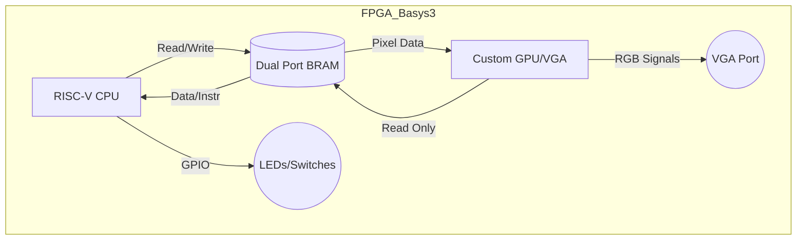

# retro-risc-machine

> **A complete System-on-Chip (SoC) built from scratch on the Basys 3 FPGA.**
> *Custom RISC-V CPU + Custom GPU + Bare-metal OS*

  
## 📖 Overview

This project is a complete implementation of a computer system designed from the ground up, running on a Digilent Basys 3 FPGA. Unlike standard implementations that use vendor IPs (like MicroBlaze), this project features a **custom-designed RISC-V processor**, a specialized **VGA graphics controller (GPU)**, and a **custom Operating System** kernel.

The goal is to demystify how computers work by building every layer of the abstraction stack: from logic gates to the graphical user interface.

## 🏗 Architecture

### 1\. Hardware (RTL - Verilog)

  * **CPU:** Custom 32-bit RISC-V Core (RV32I Instruction Set).
      * Pipeline: 5-stage (Fetch, Decode, Execute, Memory, Writeback).
      * Memory Interface: Unified memory architecture.
  * **GPU (Video Controller):**
      * Resolution: 640x480 @ 60Hz.
      * Architecture: Tile-based / Sprite-based rendering (to optimize BRAM usage).
      * Interface: Memory Mapped I/O via Dual-Port RAM.
  * **Memory System:**
      * Utilizes Artix-7 **Block RAM (BRAM)** for main memory.
      * True Dual-Port configuration (Port A: CPU, Port B: GPU).
      * No external DDR RAM used.

### 2\. Software Stack

  * **Toolchain:** RISC-V GNU Toolchain (`riscv64-unknown-elf-gcc`).
  * **Linker:** Custom linker script (`.ld`) to map instructions and data to the FPGA's BRAM addresses.
  * **Kernel:** A monolithic bare-metal kernel handling:
      * Interrupt Service Routines (ISRs).
      * Memory Mapped I/O (VGA, GPIO).
      * Basic task scheduling.

-----

## 🔌 Block Diagram



## 🛠️ Requirements

### Hardware

  * **Board:** Digilent Basys 3 (Xilinx Artix-7 XC7A35T).
  * **Display:** Standard VGA Monitor.
  * **Cables:** Micro USB (programming) & VGA cable.

### Software

  * **Synthesis:** Xilinx Vivado Design Suite (2020.x or newer).
  * **Compilation:** RISC-V GNU Toolchain (installed on Linux or WSL).
  * **Simulation:** Vivado Simulator (XSim) or Verilator.

-----

## 📂 Project Structure

```bash
.
├── rtl/              # Verilog/SystemVerilog Source Code
│   ├── cpu/          # ALU, Control Unit, Register File
│   ├── gpu/          # VGA Sync, Sprite Renderers
│   └── memory/       # BRAM wrappers
├── sw/               # Software (C and Assembly)
│   ├── boot/         # Startup code (crt0.s)
│   ├── kernel/       # OS Kernel source
│   ├── drivers/      # VGA and GPIO drivers
│   └── tools/        # Scripts to convert ELF to .COE
├── sim/              # Testbenches
├── constraints/      # XDC file (Pinout for Basys 3)
└── README.md
```

## 🚀 Getting Started

### 1\. Compile the Software

Before synthesizing the hardware, the software must be compiled into a memory initialization file (`.coe`).

```bash
cd sw/
make all
# This generates 'image.coe' containing the OS and GUI code.
```

### 2\. Build the Hardware (Vivado)

1.  Open Vivado and create a new project for **Basys 3**.
2.  Add all files from the `rtl/` directory.
3.  Add the constraints file from `constraints/`.
4.  In the Block Memory Generator IP settings, load the `sw/image.coe` file generated in step 1.
5.  Run **Generate Bitstream**.

### 3\. Deploy

1.  Connect the Basys 3 via USB.
2.  Open Hardware Manager in Vivado.
3.  Program device.
4.  The OS should boot immediately on the VGA monitor.

-----

## 🔮 Roadmap / To-Do

  - [ ] Implement RV32I Base Instruction Set.
  - [ ] Create VGA Sync Generator (640x480).
  - [ ] Implement True Dual-Port BRAM Controller.
  - [ ] Write Linker Script for direct BRAM mapping.
  - [ ] Develop "Sprite Engine" for the GPU.
  - [ ] Implement basic GUI library (Draw Rect, Draw Text).
  - [ ] Add Keyboard support (PS/2) for user input.

## 🤝 Contributing

This is a personal educational project. However, suggestions on architecture and optimization are welcome\!

## 📄 License

This project is licensed under the MIT License - see the [LICENSE](https://www.google.com/search?q=LICENSE) file for details.
