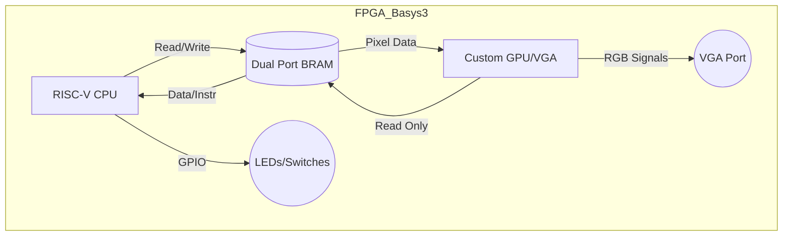

# retro-risc-machine

> **A complete System-on-Chip (SoC) built from scratch on the Basys 3 FPGA.**
> *Custom RISC-V CPU + Custom GPU + Bare-metal OS*

  
## 📖 Overview

This project is a complete implementation of a computer system designed from the ground up, running on a Digilent Basys 3 FPGA. Unlike standard implementations that use vendor IPs (like MicroBlaze), this project features a **custom-designed RISC-V processor**, a specialized **VGA graphics controller (GPU)**, and a **custom Operating System** kernel.

The goal is to demystify how computers work by building every layer of the abstraction stack: from logic gates to the graphical user interface.

## 🏗 Architecture

### 1\. Hardware (RTL - Verilog)

  * **CPU:** Custom 32-bit RISC-V Core (RV32I Instruction Set).
      * Pipeline: 5-stage (Fetch, Decode, Execute, Memory, Writeback).
      * Memory Interface: Unified memory architecture.
  * **GPU (Video Controller):**
      * Resolution: 640x480 @ 60Hz.
      * Architecture: Tile-based / Sprite-based rendering (to optimize BRAM usage).
      * Interface: Memory Mapped I/O via Dual-Port RAM.
  * **Memory System:**
      * Utilizes Artix-7 **Block RAM (BRAM)** for main memory.
      * True Dual-Port configuration (Port A: CPU, Port B: GPU).
      * No external DDR RAM used.

### 2\. Software Stack

  * **Toolchain:** RISC-V GNU Toolchain (`riscv64-unknown-elf-gcc`).
  * **Linker:** Custom linker script (`.ld`) to map instructions and data to the FPGA's BRAM addresses.
  * **Kernel:** A monolithic bare-metal kernel handling:
      * Interrupt Service Routines (ISRs).
      * Memory Mapped I/O (VGA, GPIO).
      * Basic task scheduling.

-----

## 🔌 Block Diagram

## 🛠️ Requirements

### Hardware

  * **Board:** Digilent Basys 3 (Xilinx Artix-7 XC7A35T).
  * **Display:** Standard VGA Monitor.
  * **Cables:** Micro USB (programming) & VGA cable.

### Software

  * **Synthesis:** Xilinx Vivado Design Suite (2020.x or newer).

-----

# RISC-V Instruction Set

## Core Instruction Formats

| 31 ... 27 | 26 ... 25 | 24 ... 20 | 19 ... 15 | 14 ... 12 | 11 ... 7 | 6 ... 0 | Type |
| :---: | :---: | :---: | :---: | :---: | :---: | :---: | :--- |
| **funct7** | **rs2** | **rs1** | **funct3** | **rd** | **opcode** | **R-type** |
| imm[11:0] | | rs1 | funct3 | rd | opcode | **I-type** |
| imm[11:5] | rs2 | rs1 | funct3 | imm[4:0] | opcode | **S-type** |
| imm[12\|10:5] | rs2 | rs1 | funct3 | imm[4:1\|11] | opcode | **B-type** |
| imm[31:12] | | | | rd | opcode | **U-type** |
| imm[20\|10:1\|11\|19:12] | | | | rd | opcode | **J-type** |

---

## RV32I Base Integer Instructions

| Inst | Name | FMT | Opcode | funct3 | funct7 | Description (C) | Note |
| :--- | :--- | :---: | :---: | :---: | :---: | :--- | :--- |
| **add** | ADD | R | 0110011 | 0x0 | 0x00 | rd = rs1 + rs2 | |
| **sub** | SUB | R | 0110011 | 0x0 | 0x20 | rd = rs1 - rs2 | |
| **xor** | XOR | R | 0110011 | 0x4 | 0x00 | rd = rs1 ^ rs2 | |
| **or** | OR | R | 0110011 | 0x6 | 0x00 | rd = rs1 \| rs2 | |
| **and** | AND | R | 0110011 | 0x7 | 0x00 | rd = rs1 & rs2 | |
| **sll** | Shift Left Logical | R | 0110011 | 0x1 | 0x00 | rd = rs1 << rs2 | |
| **srl** | Shift Right Logical | R | 0110011 | 0x5 | 0x00 | rd = rs1 >> rs2 | |
| **sra** | Shift Right Arith* | R | 0110011 | 0x5 | 0x20 | rd = rs1 >> rs2 | msb-extends |
| **slt** | Set Less Than | R | 0110011 | 0x2 | 0x00 | rd = (rs1 < rs2)?1:0 | |
| **sltu** | Set Less Than (U) | R | 0110011 | 0x3 | 0x00 | rd = (rs1 < rs2)?1:0 | zero-extends |
| **addi** | ADD Immediate | I | 0010011 | 0x0 | | rd = rs1 + imm | |
| **xori** | XOR Immediate | I | 0010011 | 0x4 | | rd = rs1 ^ imm | |
| **ori** | OR Immediate | I | 0010011 | 0x6 | | rd = rs1 \| imm | |
| **andi** | AND Immediate | I | 0010011 | 0x7 | | rd = rs1 & imm | |
| **slli** | Shift Left Logical Imm | I | 0010011 | 0x1 | imm[5:11]=0x00 | rd = rs1 << imm[0:4] | |
| **srli** | Shift Right Logical Imm | I | 0010011 | 0x5 | imm[5:11]=0x00 | rd = rs1 >> imm[0:4] | |
| **srai** | Shift Right Arith Imm | I | 0010011 | 0x5 | imm[5:11]=0x20 | rd = rs1 >> imm[0:4] | msb-extends |
| **slti** | Set Less Than Imm | I | 0010011 | 0x2 | | rd = (rs1 < imm)?1:0 | |
| **sltiu**| Set Less Than Imm (U) | I | 0010011 | 0x3 | | rd = (rs1 < imm)?1:0 | zero-extends |
| **lb** | Load Byte | I | 0000011 | 0x0 | | rd = M[rs1+imm][0:7] | |
| **lh** | Load Half | I | 0000011 | 0x1 | | rd = M[rs1+imm][0:15] | |
| **lw** | Load Word | I | 0000011 | 0x2 | | rd = M[rs1+imm][0:31] | |
| **lbu** | Load Byte (U) | I | 0000011 | 0x4 | | rd = M[rs1+imm][0:7] | zero-extends |
| **lhu** | Load Half (U) | I | 0000011 | 0x5 | | rd = M[rs1+imm][0:15] | zero-extends |
| **sb** | Store Byte | S | 0100011 | 0x0 | | M[rs1+imm][0:7] = rs2[0:7] | |
| **sh** | Store Half | S | 0100011 | 0x1 | | M[rs1+imm][0:15] = rs2[0:15] | |
| **sw** | Store Word | S | 0100011 | 0x2 | | M[rs1+imm][0:31] = rs2[0:31] | |
| **beq** | Branch == | B | 1100011 | 0x0 | | if(rs1 == rs2) PC += imm | |
| **bne** | Branch != | B | 1100011 | 0x1 | | if(rs1 != rs2) PC += imm | |
| **blt** | Branch < | B | 1100011 | 0x4 | | if(rs1 < rs2) PC += imm | |
| **bge** | Branch >= | B | 1100011 | 0x5 | | if(rs1 >= rs2) PC += imm | |
| **bltu** | Branch < (U) | B | 1100011 | 0x6 | | if(rs1 < rs2) PC += imm | zero-extends |
| **bgeu** | Branch >= (U) | B | 1100011 | 0x7 | | if(rs1 >= rs2) PC += imm | zero-extends |
| **jal** | Jump And Link | J | 1101111 | | | rd = PC+4; PC += imm | |
| **jalr** | Jump And Link Reg | I | 1100111 | 0x0 | | rd = PC+4; PC = rs1 + imm | |
| **lui** | Load Upper Imm | U | 0110111 | | | rd = imm << 12 | |
| **auipc**| Add Upper Imm to PC | U | 0010111 | | | rd = PC + (imm << 12) | |
| **ecall**| Environment Call | I | 1110011 | 0x0 | imm=0x0 | Transfer control to OS | |
| **ebreak**| Environment Break | I | 1110011 | 0x0 | imm=0x1 | Transfer control to debugger | |

## 🤝 Contributing

This is a personal educational project. However, suggestions on architecture and optimization are welcome\!

## 📄 License

This project is licensed under the MIT License - see the [LICENSE](https://www.google.com/search?q=LICENSE) file for details.
